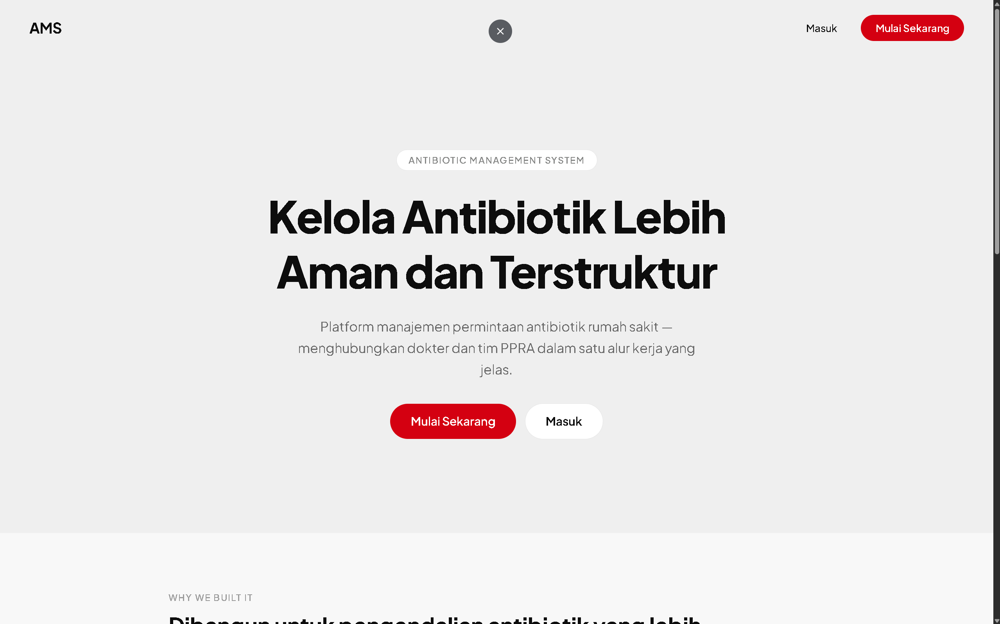
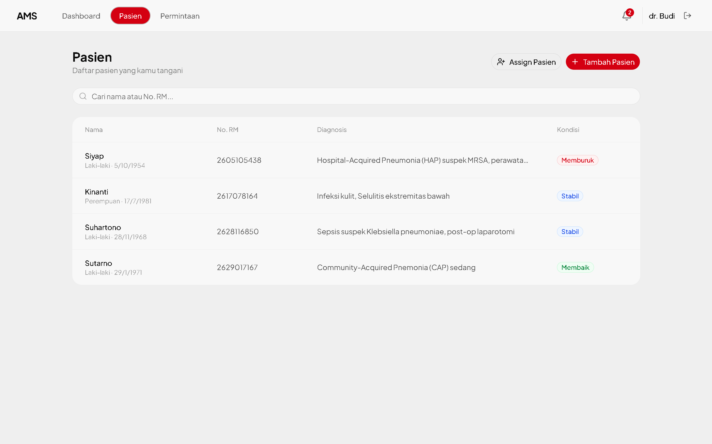
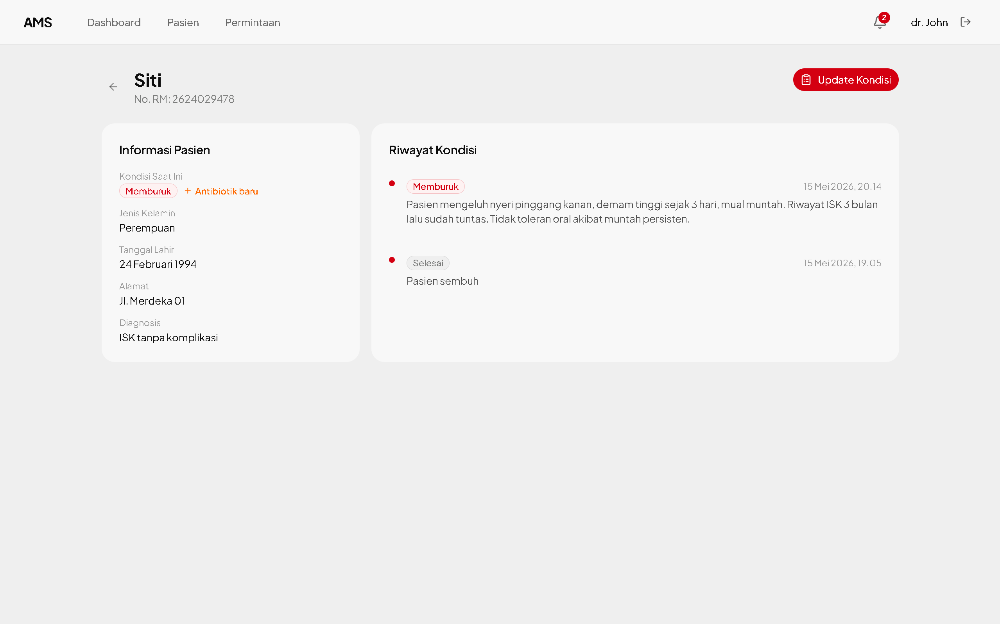
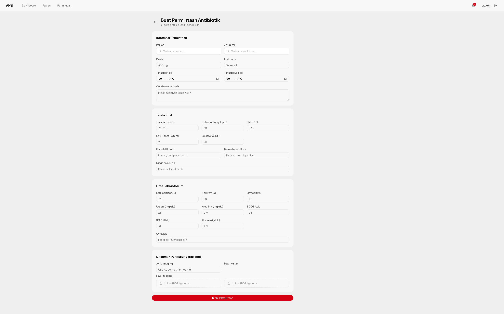
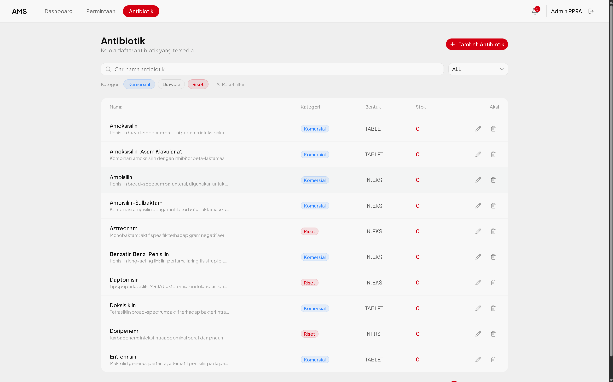
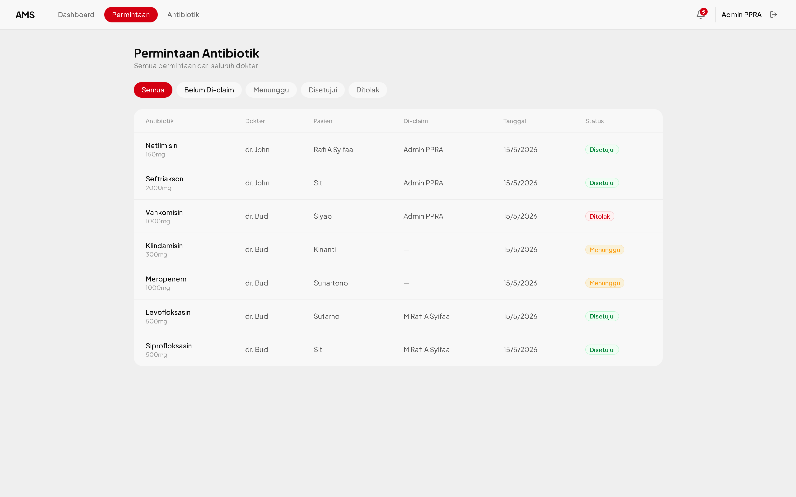

# AMS — Antibiotic Management System (Frontend)

Frontend application for **AMS**, a web-based antibiotic management system that helps hospitals control antibiotic usage through a structured request and review workflow between doctors and PPRA admins.

> Backend repository: [crack-be-mrafiasyifaa](https://github.com/Revou-FSSE-Oct25/crack-be-mrafiasyifaa)

---

## Features

### Doctor

- Register and login with role-based access
- Manage patients: add new patients, assign existing patients via medical record number (No. RM) with 2-step verification
- View patient detail and update patient condition (Stabil / Membaik / Memburuk / Selesai)
- Deactivate patients who have recovered (Selesai)
- Submit antibiotic requests with complete clinical data and file attachments (imaging, culture results)
- Quick shortcut to create a new antibiotic request when a patient's condition worsens (Memburuk)
- View request history and cancel pending requests
- Receive in-app notifications for approved or rejected requests

### Admin (PPRA)

- Manage antibiotic inventory: create, edit, and delete antibiotics with category and form classification
- Browse and search antibiotics with filters (category, form, keyword) and pagination
- View all incoming antibiotic requests with status filters and unclaimed pool
- Claim requests for self-assignment and unclaim if needed
- Approve or reject requests with review notes
- Receive in-app notifications for new requests and expiring antibiotics

### General

- Role-based route protection via middleware
- Persistent authentication via JWT (localStorage + cookie)
- In-app notification popover with unread badge and mark-all-read
- Responsive UI across all pages and roles

---

## Tech Stack

| Layer               | Technology                    |
| ------------------- | ----------------------------- |
| Framework           | Next.js 16 (App Router)       |
| Language            | TypeScript                    |
| Styling             | Tailwind CSS v4               |
| UI Components       | shadcn/ui, Base UI            |
| Forms               | React Hook Form + Zod         |
| State Management    | Zustand                       |
| File Storage        | Supabase Storage              |
| HTTP Client         | Native Fetch (custom wrapper) |
| Icons               | Lucide React                  |
| Toast Notifications | Sonner                        |

---

## Getting Started

### Prerequisites

- Node.js 18+
- npm
- Backend server running (see backend repo)

### Installation

```bash
# Clone the repository
git clone https://github.com/mrafiasyifaa/crack-fe-mrafiasyifaa.git
cd crack-fe-mrafiasyifaa

# Install dependencies
npm install
```

### Environment Variables

Create a `.env.local` file in the root directory:

```env
NEXT_PUBLIC_API_URL=http://localhost:3000/api
NEXT_PUBLIC_SUPABASE_URL=your_supabase_project_url
NEXT_PUBLIC_SUPABASE_ANON_KEY=your_supabase_anon_key
```

### Running the App

```bash
# Development
npm run dev

# Production build
npm run build
npm run start
```

Open [http://localhost:3001](http://localhost:3001) in your browser.

---

## Deployment

|          | URL                                              |
| -------- | ------------------------------------------------ |
| Frontend | https://crack-fe-mrafiasyifaa.vercel.app         |
| Backend  | https://crack-be-mrafiasyifaa.onrender.com       |

---

## Screenshots

Screenshots are stored in [`documentations/`](documentations/).

### Landing Page



### Doctor — Patient List



### Doctor — Patient Detail & Condition History



### Doctor — New Antibiotic Request Form



### Admin — Antibiotic Management



### Admin — Request Review



---

## Project Structure

```
src/
├── app/
│   ├── (auth)/          # Login, Register
│   ├── (doctor)/        # Doctor pages
│   │   └── doctor/
│   │       ├── dashboard/
│   │       ├── patients/
│   │       └── requests/
│   ├── (admin)/         # Admin pages
│   │   └── admin/
│   │       ├── dashboard/
│   │       ├── antibiotics/
│   │       └── requests/
│   └── page.tsx         # Landing page
├── components/
│   ├── ui/              # Reusable UI components
│   ├── navbar.tsx
│   └── notification-popover.tsx
├── lib/
│   ├── api.ts           # HTTP client wrapper
│   └── supabase.ts      # Supabase client
├── stores/              # Zustand state stores
└── types/               # TypeScript type definitions
```
